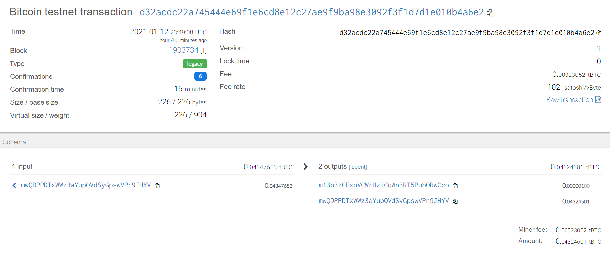
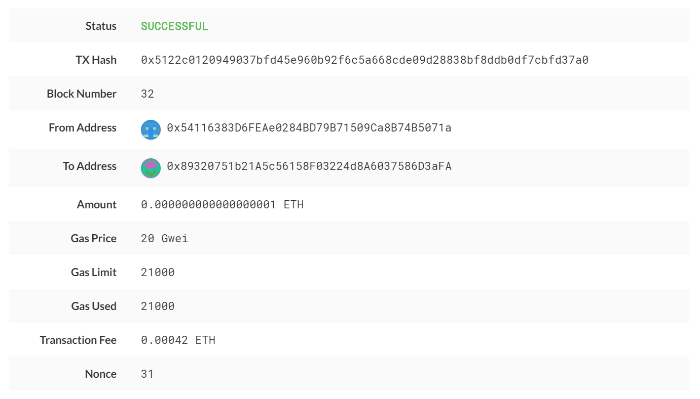

### Project Objective

This objective of this project is to leverage Python alongside blockchain technology to transact on crypto wallets.  In this project specifically, Ethereum (ETH) and Bitcoin Testnet (BTCTEST) wallets were utilized.  Numerous functions were defined to assist in deriiving wallets, converting private keys to account addresses, and create and send transactions for each account.  The Python Bit and Web3 libraries were leveraged to accomplish these tasks. 

### About the Wallet

The first step to interact with the wallet file created is to ensure all installs have been completed.  As mentioned, both the Bit and Web3 Python libraries need to be installed.  These installs are fairly quick and easy to complete in your terminal (GitBash).  Installation instructions can be found below.  In addition to the Bit and Web3 libraries, hd-wallet-derive also needs to be cloned to the local directory you are working in.  A guide to complete this process is below as well.  This install can be slightly more challenging, so a link to a video guide is also included in the install instructions. 

[Bit/Web3 Install Guide](Install Guides/Blockchain_TX_Install_Guide.md)

[HD-Wallet-Derive Install Guide](Install Guides/HD_Wallet_Derive_Install_Guide.md)

Once all installs / dependencies are met, the wallet can now be interacted with.  The first step was to import a mnemonic phrase.  This was set as an environment variable and pulled into the code as such.  The first function created allows you to derive the wallets you will be working with.  A coin symbol (BTC, ETH, BTCTEST) can be passed into the function and the function will output wallet addresses, private keys, and public keys.  Since "numderive" is set to 3 within the function, only 3 outputs will be produced for each coin.  A "coins" dictionary object was created to store data derived from this function for ETH and BTCTEST.  

The next function defined was created to convert private keys to string accout objects.  String account objects need to be passed into Web3 and Bit to allow them to be transacted on.  This function is then leveraged when creating "eth_account" and "btc_account" variables.  These variables were created to simpifiy the code and allow for smoother transactions.  

The final two functions created were "create_tx" and "send_tx".  The "create_tx" function accepts coin, account, recipient and amount values and will then generate a raw, unsigned transaction with all needed metadat to transact.  This function is then called in the "send_tx" function to actually send the transactions.  The "send_tx" fucntion accepts the same variables, being coin, account, recipient and amount.  Both functions are set up accordingly to transact accordingly if the coin passed in is ETH or BTCTEST.  The Web3 library is called upon in each function to process ETH transactions, and the Bit library does the same for BTCTEST transactions.  To test that everything works correctly, each function can be called, all required data be passed in, and the program can be run.  Transactions can be tracked in MyCrypto, the bitcoin testnet site, or any other online tool.  The addresses transacted on can be entered into these sites to pull the transaction history.  

To demonstrate transactions being completed after running the wallet file, below are two examples.  

BTCTEST Transaction Code: 
  - create_tx(BTCTEST, btc_account, 'mwQDPPDTxWWz3aYupQVdSyGpswVPn9JHYV', .000001)
  - send_tx(BTCTEST, btc_account, 'mt3p3zCExoVCWrHziCqWn3RT5PubQRwCco', .000001)
  - Transaction Hash: d32acdc22a745444e69f1e6cd8e12c27ae9f9ba98e3092f3f1d7d1e010b4a6e2
  
 

ETH Transaction Code: 
  - create_tx(ETH, eth_account, '0x89320751b21A5c56158F03224d8A6037586D3aFA', 1)
  - send_tx(ETH, eth_account, '0x89320751b21A5c56158F03224d8A6037586D3aFA', 1)
  - Transaction Hash: 0x5122c0120949037bfd45e960b92f6c5a668cde09d28838bf8ddb0df7cbfd37a0

 
